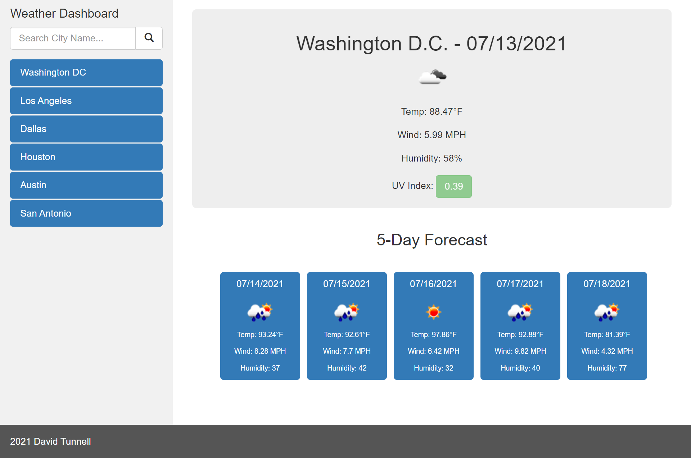

# Weather Dashboard Third Party API Consumption

This is a weather dashboard that is dynamically updated based on data coming from the 3rd party API OpenWeather. It utilizes Bootstrap for page layout.

https://openweathermap.org/api/one-call-api

Persistent data is stored in local storage.

A live demo can be found here: https://davidtunnell.github.io/weather-dashboard-third-party-api/

#Screenshots

